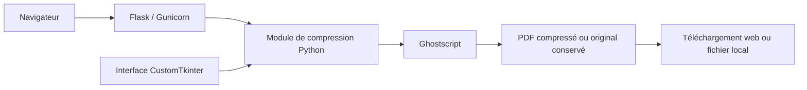

<div align="center">

# 📄 CompressFile — PDF Toolkit

**Des PDF plus légers, traités sur votre machine.**

Un outil de compression PDF avec une interface web en français, quatre niveaux de qualité et une interface bureau optionnelle.


[Fonctionnalités](#-fonctionnalités) · [Démarrage Docker](#démarrage-rapide-avec-docker) · [Utilisation](#utilisation) · [Développement](#développement-local)

</div>

---

## 🎯 Présentation

**CompressFile**, nommé **PDF Toolkit** dans l’interface, permet de réduire la taille d’un PDF pour faciliter son partage ou son stockage. Sélectionnez un document, choisissez le compromis entre qualité et compression, puis récupérez le résultat.

La compression est effectuée par l’exécutable Ghostscript sur la machine qui héberge l’application. Aucun service externe de traitement, compte ou clé API n’est nécessaire.

## ✨ Fonctionnalités

- **Interface web en français** : sélection du fichier, choix de qualité et téléchargement.
- **Quatre réglages** : compression forte, équilibrée, légère ou haute qualité.
- **Résultat mesurable** : affichage du pourcentage de réduction et de la taille du fichier produit.
- **Préservation du contenu original** si la compression ne réduit pas la taille du document.
- **Gestion des erreurs** : fichier invalide, niveau inconnu, dépassement de taille ou traitement trop long.
- **Interface bureau optionnelle** avec sélection de la destination et traitement en arrière-plan.
- **Démarrage avec Docker Compose**, sans installation locale de Python ou Ghostscript.

L’outil traite un PDF à la fois par soumission. La fusion, le découpage et la conversion d’autres formats ne font pas partie des fonctionnalités actuelles.

## 🛠️ Stack technique

| Usage | Technologie |
| --- | --- |
| Compression | Ghostscript, moteur `pdfwrite` |
| Backend web | Python 3.12, Flask 3.1.3 |
| Serveur dans Docker | Gunicorn 23.0.0, deux workers |
| Interface web | HTML, CSS et JavaScript, ressources servies sans CDN |
| Interface bureau | CustomTkinter 5.2.2, Tkinter |
| Exécution locale conteneurisée | Docker et Docker Compose |
| Tests et intégration continue | `unittest`, GitHub Actions |

## Démarrage rapide avec Docker

Prérequis : Docker Engine ou Docker Desktop, avec Docker Compose v2.
Depuis le dossier du projet :

```bash
docker compose up --build -d
```

Ouvrez **http://localhost:8080**. Aucun compte, service externe ou volume à configurer.

```bash
# Voir les journaux
docker compose logs -f

# Arrêter l’application
docker compose down
```

Pour utiliser un autre port :

```bash
PORT=8090 docker compose up -d
```

Sur PowerShell : `$env:PORT=8090` puis `docker compose up -d`.

Sans Compose :

```bash
docker build -t pdf-toolkit .
docker run --rm -p 127.0.0.1:8080:8080 pdf-toolkit
```

## Utilisation

1. Choisissez un fichier PDF (envoi limité à **50 Mio**, formulaire compris).
2. Sélectionnez le niveau de qualité.
3. Cliquez sur **Compresser le PDF**, puis sur **Télécharger le PDF**.

| Réglage | Usage |
| --- | --- |
| Forte (`screen`) | Lecture à l’écran, images moins détaillées |
| Équilibrée (`ebook`) | Partage courant, réglage par défaut |
| Légère (`printer`) | Documents destinés à l’impression |
| Haute qualité (`prepress`) | Priorité à la qualité des images |

La réduction dépend du contenu : un PDF essentiellement textuel ou déjà optimisé peut peu changer. Si la sortie est plus volumineuse, l’application renvoie le fichier original. La compression réécrit le PDF : utilisez l’original pour conserver les signatures numériques et vérifiez le rendu des documents importants.

## Confidentialité et limites

- Les documents sont traités sur la machine qui héberge l’application, sans service tiers.
- Les fichiers temporaires sont supprimés après traitement ; aucun historique n’est conservé.
- Une compression est limitée à 120 secondes. Deux traitements peuvent être exécutés simultanément.
- Compose utilise un compte sans privilèges, un système de fichiers en lecture seule et un espace temporaire en mémoire de 512 Mio, avec une limite de 1 Gio de mémoire par conteneur.
- Le port est accessible uniquement depuis votre machine par défaut. Cette application personnelle n’intègre pas d’authentification : une exposition publique nécessite une protection adaptée.

## Développement local

Python 3.12 et Ghostscript sont nécessaires. Sous Debian/Ubuntu :

```bash
sudo apt-get update
sudo apt-get install -y ghostscript python3-venv
python3 -m venv .venv
source .venv/bin/activate
pip install -r requirements.txt
flask --app app run --port 8080
```

Le serveur Flask sert au développement ; l’image Docker utilise Gunicorn.

### Interface bureau optionnelle

L’interface CustomTkinter reste disponible hors Docker, avec Python, Ghostscript et Tk installés :

```bash
# Debian/Ubuntu : sudo apt-get install python3-tk
pip install -r requirements-desktop.txt
python main.py
```

La compression s’exécute en arrière-plan pour garder la fenêtre réactive.

### Tests

```bash
python -m unittest discover -s tests -v
```

Les tests couvrent les erreurs, les limites d’envoi, la préservation des fichiers et la compression réelle avec Ghostscript pour les quatre niveaux de qualité. Le test réel est ignoré si Ghostscript manque. GitHub Actions installe Ghostscript, exécute les tests et vérifie le démarrage Docker.

## 🔌 Routes web

| Méthode | Route | Fonction |
| --- | --- | --- |
| `GET` | `/` | Afficher l’interface de compression |
| `GET` | `/health` | Retourner `{"status": "ok"}` pour la sonde de vie |
| `POST` | `/compress` | Recevoir un PDF et renvoyer le résultat en téléchargement |

La route de compression attend un formulaire `multipart/form-data` avec le fichier dans `file` et le réglage dans `quality` (`ebook` par défaut).

Exemple depuis un terminal, une fois l’application démarrée :

```bash
curl --fail-with-body \
  -F 'file=@document.pdf' \
  -F 'quality=ebook' \
  http://localhost:8080/compress \
  --output document-compresse.pdf
```

Le serveur renvoie une erreur `400` pour une entrée invalide ou une compression refusée, `413` pour une requête trop volumineuse, et `500` pour certaines erreurs de traitement. La sonde `/health` indique que le serveur répond ; elle n’exécute pas de compression.

## 🧭 Fonctionnement



Le module partagé vérifie l’en-tête PDF, lance Ghostscript avec une limite de temps et compare la taille obtenue à celle de l’original. Il écrit d’abord dans un fichier temporaire, puis remplace la destination seulement lorsque le traitement a abouti. Un échec de conversion ne tronque donc pas un fichier de destination existant.

Dans le parcours web, le résultat est chargé en mémoire avant la suppression du répertoire temporaire. Dans l’interface bureau, il est enregistré à l’emplacement choisi par l’utilisateur.

## Organisation

```text
app.py                    Interface web Flask
compressor.py             Compression Ghostscript partagée
gui.py / main.py          Interface bureau optionnelle
templates/ / static/      Interface web (sans CDN)
tests/                    Tests unitaires et intégration
Dockerfile / compose.yaml Déploiement local
```

Les dépendances Python web et bureau sont séparées. Le module Python `ghostscript`, `pdf2image` et `pymupdf` ne sont pas nécessaires : la compression utilise directement l’exécutable système `gs`.

Références : [gestion des fichiers avec Flask](https://flask.palletsprojects.com/en/stable/patterns/fileuploads/) et [configuration Gunicorn](https://docs.gunicorn.org/en/stable/settings.html).


## 🧪 Intégration continue

Le workflow [CI](.github/workflows/ci.yml) s’exécute lors des pushes et des pull requests. Il installe Python et Ghostscript, lance les tests, valide la configuration Compose, construit le conteneur et vérifie la réponse de `/health`.

Ce workflow assure des contrôles de fonctionnement ; il ne publie pas d’image Docker et ne déploie pas l’application sur un serveur distant.

---

<div align="center">

**PDF Toolkit** · Compresser simplement, conserver le contrôle de ses documents.

</div>
